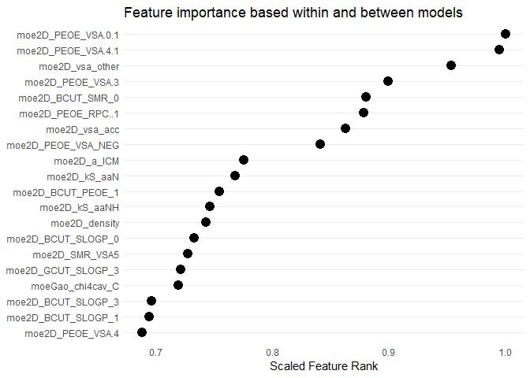
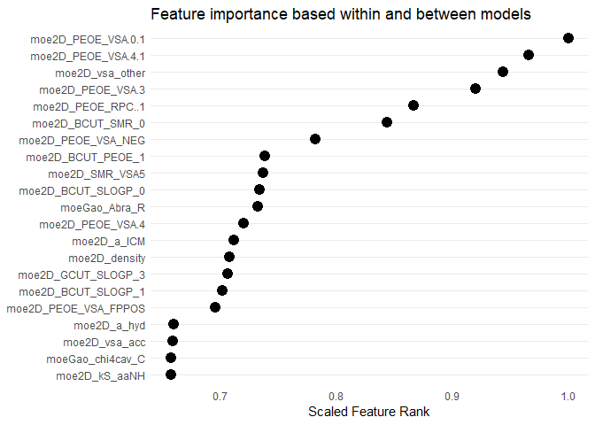

</br>


```r
library(devtools)    
library(tidyverse)   
library(caret)       
library(HSPSModelR)  
```


The dhfr dataset is included in the caret package. It contains the molecular composition of 325 different compounds, as well as a classification on whether or not they inhibit dyhydrofolate reductase (dhfr). There are 228 molecular quantities described for each compound.

```r
data(dhfr)
as.tibble(dhfr)
```

```
## # A tibble: 325 x 229
##    Y     moeGao_Abra_L moeGao_Abra_R moeGao_Abra_aci~ moeGao_Abra_bas~
##    <fct>         <dbl>         <dbl>            <dbl>            <dbl>
##  1 inac~         2.92        1.55              2.38              4.16 
##  2 inac~        -0.548      -0.157             0.0101            0.647
##  3 inac~         0.630       0.792             0.0101            2.73 
##  4 inac~        -2.09       -1.45              1.35             -0.267
##  5 inac~        -2.23       -1.39              0.524             0.472
##  6 inac~        -2.26       -1.43              0.524             0.572
##  7 inac~         0.865       0.303             0.0101            0.302
##  8 inac~         0.350      -0.363             0.670            -0.283
##  9 inac~         0.819      -0.00830           0.0101            0.302
## 10 inac~        -0.303      -0.434             0.0101           -1.39 
## # ... with 315 more rows, and 224 more variables: moeGao_Abra_pi <dbl>,
## #   moe2D_BCUT_PEOE_0 <dbl>, moe2D_BCUT_PEOE_1 <dbl>,
## #   moe2D_BCUT_PEOE_2 <dbl>, moe2D_BCUT_PEOE_3 <dbl>,
## #   moe2D_BCUT_SLOGP_0 <dbl>, moe2D_BCUT_SLOGP_1 <dbl>,
## #   moe2D_BCUT_SLOGP_2 <dbl>, moe2D_BCUT_SLOGP_3 <dbl>,
## #   moe2D_BCUT_SMR_0 <dbl>, moe2D_BCUT_SMR_1 <dbl>,
## #   moe2D_BCUT_SMR_2 <dbl>, moe2D_BCUT_SMR_3 <dbl>, moe2D_FCharge <dbl>,
## #   moe2D_GCUT_PEOE_0 <dbl>, moe2D_GCUT_PEOE_1 <dbl>,
## #   moe2D_GCUT_PEOE_2 <dbl>, moe2D_GCUT_PEOE_3 <dbl>,
## #   moe2D_GCUT_SLOGP_0 <dbl>, moe2D_GCUT_SLOGP_1 <dbl>,
## #   moe2D_GCUT_SLOGP_2 <dbl>, moe2D_GCUT_SLOGP_3 <dbl>,
## #   moe2D_GCUT_SMR_0 <dbl>, moe2D_GCUT_SMR_1 <dbl>,
## #   moe2D_GCUT_SMR_2 <dbl>, moe2D_GCUT_SMR_3 <dbl>, moe2D_Kier1 <dbl>,
## #   moe2D_Kier2 <dbl>, moe2D_Kier3 <dbl>, moe2D_KierA1 <dbl>,
## #   moe2D_KierA2 <dbl>, moe2D_KierA3 <dbl>, moe2D_KierFlex <dbl>,
## #   moe2D_PEOE_PC. <dbl>, moe2D_PEOE_PC..1 <dbl>, moe2D_PEOE_RPC. <dbl>,
## #   moe2D_PEOE_RPC..1 <dbl>, moe2D_PEOE_VSA.0 <dbl>,
## #   moe2D_PEOE_VSA.1 <dbl>, moe2D_PEOE_VSA.2 <dbl>,
## #   moe2D_PEOE_VSA.3 <dbl>, moe2D_PEOE_VSA.4 <dbl>,
## #   moe2D_PEOE_VSA.5 <dbl>, moe2D_PEOE_VSA.6 <dbl>,
## #   moe2D_PEOE_VSA.0.1 <dbl>, moe2D_PEOE_VSA.1.1 <dbl>,
## #   moe2D_PEOE_VSA.2.1 <dbl>, moe2D_PEOE_VSA.3.1 <dbl>,
## #   moe2D_PEOE_VSA.4.1 <dbl>, moe2D_PEOE_VSA.5.1 <dbl>,
## #   moe2D_PEOE_VSA.6.1 <dbl>, moe2D_PEOE_VSA_FHYD <dbl>,
## #   moe2D_PEOE_VSA_FNEG <dbl>, moe2D_PEOE_VSA_FPNEG <dbl>,
## #   moe2D_PEOE_VSA_FPOL <dbl>, moe2D_PEOE_VSA_FPOS <dbl>,
## #   moe2D_PEOE_VSA_FPPOS <dbl>, moe2D_PEOE_VSA_HYD <dbl>,
## #   moe2D_PEOE_VSA_NEG <dbl>, moe2D_PEOE_VSA_PNEG <dbl>,
## #   moe2D_PEOE_VSA_POL <dbl>, moe2D_PEOE_VSA_POS <dbl>,
## #   moe2D_PEOE_VSA_PPOS <dbl>, moe2D_Q_PC. <dbl>, moe2D_Q_PC..1 <dbl>,
## #   moe2D_Q_RPC. <dbl>, moe2D_Q_RPC..1 <dbl>, moe2D_Q_VSA_FHYD <dbl>,
## #   moe2D_Q_VSA_FNEG <dbl>, moe2D_Q_VSA_FPNEG <dbl>,
## #   moe2D_Q_VSA_FPOL <dbl>, moe2D_Q_VSA_FPOS <dbl>,
## #   moe2D_Q_VSA_FPPOS <dbl>, moe2D_Q_VSA_HYD <dbl>, moe2D_Q_VSA_NEG <dbl>,
## #   moe2D_Q_VSA_PNEG <dbl>, moe2D_Q_VSA_POL <dbl>, moe2D_Q_VSA_POS <dbl>,
## #   moe2D_Q_VSA_PPOS <dbl>, moe2D_SMR <dbl>, moe2D_SMR_VSA0 <dbl>,
## #   moe2D_SMR_VSA1 <dbl>, moe2D_SMR_VSA2 <dbl>, moe2D_SMR_VSA3 <dbl>,
## #   moe2D_SMR_VSA4 <dbl>, moe2D_SMR_VSA5 <dbl>, moe2D_SMR_VSA6 <dbl>,
## #   moe2D_SMR_VSA7 <dbl>, moe2D_SlogP <dbl>, moe2D_SlogP_VSA0 <dbl>,
## #   moe2D_SlogP_VSA1 <dbl>, moe2D_SlogP_VSA2 <dbl>,
## #   moe2D_SlogP_VSA3 <dbl>, moe2D_SlogP_VSA4 <dbl>,
## #   moe2D_SlogP_VSA5 <dbl>, moe2D_SlogP_VSA6 <dbl>,
## #   moe2D_SlogP_VSA7 <dbl>, moe2D_SlogP_VSA8 <dbl>,
## #   moe2D_SlogP_VSA9 <dbl>, moe2D_TPSA <dbl>, ...
```

</br>

</br>

</br>

## **preprocess_data**

Prepares data for binary classification tasks, specifically ones in this package, by imputing missing values, eliminating low-information features, and more.

```r
preprocess_data(x, target = "y")
```

</br>

The targets must be coded as factors.

```r
# we check if your targets are coded as factors.
  if (target_column %>% is.factor() == TRUE) {
    message("Target is already a factor")

    
# if they are not, the default action is simply to reassign them as factors.
  } else if (factor_y == TRUE) {
    VALUE <- NULL
    wrapr::let(
      c(VALUE = target),
      x <- x %>% mutate(VALUE = as.factor(VALUE))
    )
    message("Converted ", target, " into a factor")
```

We've wrapped these useful pre-processing functions into preprocess_data.

```r
caret::findCorrelation(x, cutoff = 0.9)

caret::nearZeroVar(x)

naniar::impute_mean_if(x, .predicate = any_na)

DMwR::knnImputation(x)
```

We don't want IDs or row numbers to affect the preprocessing.

```r
# at the beginning of the function we ungroup the data, then temporarily remove IDs.
  if (sum(class(x) == "grouped_df") > 0) {
    x <- x %>% ungroup()
    message("Data has been ungrouped")
  }

  if (sum(names(x) %>% str_detect("ID")) > 0) {
    ids <- x %>% select(ID)
    x   <- x %>% select(-ID)
    has_id <- TRUE
    message("ID column has been removed")

    
# At the end of the function we return IDs if they were part of the original dataset.
  if (has_id == TRUE) {
    x <- x %>%
      bind_cols(ids) %>%
        select(ID, everything())
    }

    return(x)
```

</br>

Here's the finished product with all available parameters.

```r
preprocess_data(x, 
                target = "y", 
                factor_y = TRUE, 
                impute = "zero",
                k = 10,
                reduce_cols = FALSE,
                corr_cutoff = 0.9,
                freq_cut = 95/5, 
                unique_cut = 10
                )
```

</br>

dhfr is already a rather clean datset, but we run it through the preprocess_data function to see if we can reduce the vector size.

```r
length(dhfr)
```

```
## [1] 229
```

117 columns are removed from dhfr using the default parameters in our preprocess_data function.

```r
dhfr_reduced <- preprocess_data(dhfr, target = "Y", reduce_cols = TRUE)
length(dhfr_reduced)
```

```
## [1] 112
```

</br>

The data set is ready to go as soon as we split it into a training and testing set.

```r
set.seed(1)
index   <- caret::createDataPartition(dhfr_reduced$Y, p = .8, list = F)
train_x <- dhfr_reduced[ index, 1:111]
test_x  <- dhfr_reduced[-index, 1:111]
train_y <- dhfr_reduced[ index, "Y"]
test_y  <- dhfr_reduced[-index, "Y"]
```

</br>

</br>

</br>

## **run_models**

Obtain a list of trained models from your training data.

```r
run_models(train_x, train_y)
```

</br>

The caretList function is the foundation of our run_models function. We've cut out the work of searching for and installing methods, and added a couple parameter options.

```r
caretEnsemble::caretList()
```

</br>

There are currently 238 training methods available through caret. Many require additional installations outside of caret before they can be used, so we added the **install_train_packages** to quickly prepare your environment to train each model without interruption.

```r
install_train_packages()
```

We looked into each of the 238 methods and hand-picked 68 to include in run_models.

```r
methods <- c("pda", "slda", "wsrf", "knn", "glm", "ada", "svmLinear", "bayesglm",
             "rpart2", "glmStepAIC", "mda", "nbSearch", "ranger", "spls", "binda",
             "mlpWeightDecay", "stepQDA", "plsRglm", "sparseLDA", "evtree", "lda",
             "rf", "naive_bayes", "treebag", "glmboost", "cforest", "hda", 
             "mlpWeightDecayML", "ordinalNet", "rotationForest", "svmBoundrangeString",
             "bstSm", "nodeHarvest", "rfRules", "svmLinear2", "polr", 
             "svmLinearWeights", "fda", "msaenet", "glmnet", "bagFDA", "C5.0", 
             "ctree2", "hdda", "monmlp", "plr", "rpartScore", "svmLinear3", 
             "dwdLinear", "partDSA", "rocc", "svmPoly", "sdwd", "svmRadialCost",
             "gamSpline", "null", "lda", "lvq", "bagEarth", "rpart1SE", 
             "gcvEarth", "lda2", "nb", "pls", "sda", "xgbDART", "earth", 
             "protoclass", "rotationForestCp", "svmRadialWeights")
```

</br>

Objects returned by caret::train tend to be very large; we've included the trim function as a parameter for a less dense list of models.

```r
  if (trim_models == TRUE) {
    result <- model_list %>% purrr::map(caret:::trim.train)
    return(result)
```

The light parameter trains on only five methods rather than 68.

```r
  if (light == TRUE) {
    methods <- c("glmboost", "pls", "rf", "earth", "rotationForestCp")
  }
```

Here's the finished product with all available parameters. We'll use it to train the dhfr data.

```r
models_list <- run_models(train_x     = train_x, 
                          train_y     = train_y, 
                          seed        = 1, 
                          num_folds   = 2, 
                          trim_models = TRUE, 
                          light       = TRUE)
```

</br>

The run_models function outputs a list of models. If one already has a list of trained models and doesn't wish to train 68 new ones, the **make_list** function will compile all models in a specified directory into an R list.

```r
make_list("filepath")
```


</br>

</br>

</br>

## **get_common_predictions**

Obtain a dataset containing the probabilities of a predicted outcome where each row is an observation whose outcome has been agreed upon by each model to a pre-specified extent.

```r
get_common_predictions(models,
                       test_x,
                       threshold,
                       id_col = NULL)
```

</br>

This function finds the probability that each row's target is a particular classification, and displays the mean probability along with original row numbers or IDs if included.

```r
caretEnsemble:::predict.caretList()
```

We built upon predict.caretList by creating the agreeance column to summarise the probabilities, and binding original row numbers to the probabilities.

```r
  result <- predictions_array %>%
    mutate(agreeance = (rowSums(predictions_array) / ncol(predictions_array))) %>%
    bind_cols(ID) %>%
    select(ID, agreeance, everything()) %>%
    filter(agreeance >= threshold) %>%
    arrange(desc(agreeance))

  return(result)
```

</br>

By default, this function reports on probabilities for the first appearing factor in the dataset. For our dhfr example, we will get a list of compounds where dhfr is predicted to be inhibited.

```r
get_common_predictions(models_list, test_x, threshold = 0.70)
```

```
## # A tibble: 16 x 7
##       ID agreeance glmboost   pls    rf earth rotationForestCp
##    <int>     <dbl>    <dbl> <dbl> <dbl> <dbl>            <dbl>
##  1    21     0.917    0.937 0.734 0.994 1.000            0.919
##  2    13     0.911    0.938 0.713 0.988 1.000            0.913
##  3    22     0.889    0.955 0.646 0.922 1.000            0.923
##  4     8     0.884    0.961 0.731 0.882 1.000            0.846
##  5    11     0.883    0.969 0.693 0.83  1.000            0.923
##  6     7     0.879    0.933 0.727 0.892 1.000            0.846
##  7    10     0.870    0.956 0.723 0.912 1.000            0.757
##  8     3     0.868    0.977 0.683 0.922 1.000            0.757
##  9    18     0.839    0.937 0.653 0.83  1.000            0.776
## 10    15     0.839    0.917 0.681 0.766 1.000            0.829
## 11     5     0.798    0.660 0.559 0.942 1.000            0.830
## 12    17     0.787    0.834 0.570 0.772 1.000            0.757
## 13    23     0.783    0.792 0.549 0.816 1.000            0.759
## 14    19     0.722    0.622 0.553 0.822 1.000            0.612
## 15    12     0.712    0.611 0.532 0.822 1.000            0.593
## 16     9     0.711    0.614 0.517 0.832 1.000            0.593
```

If we were intersted in compounds where dhfr was active, some quick manipulation could reveal those probabilities.

```r
get_common_predictions(models_list, test_x, threshold = 0) %>%
  mutate(other = (1 - agreeance)) %>%
  select(-agreeance) %>%
  filter(other >= 0.70) %>%
  arrange(desc(other))
```

```
## # A tibble: 34 x 7
##       ID glmboost   pls    rf    earth rotationForestCp other
##    <int>    <dbl> <dbl> <dbl>    <dbl>            <dbl> <dbl>
##  1    34  0.0306  0.236 0.004 2.22e-16           0.0724 0.931
##  2    57  0.0199  0.268 0.004 2.22e-16           0.0796 0.926
##  3    47  0.0492  0.261 0     2.22e-16           0.0796 0.922
##  4    48  0.0578  0.227 0.026 2.22e-16           0.0928 0.919
##  5    63  0.0328  0.268 0.034 2.22e-16           0.0796 0.917
##  6    51  0.0699  0.249 0.024 2.22e-16           0.0724 0.917
##  7    49  0.0686  0.244 0.026 2.22e-16           0.0928 0.914
##  8    64  0.0416  0.319 0.01  2.22e-16           0.0796 0.910
##  9     1  0.00776 0.132 0.156 2.22e-16           0.160  0.909
## 10    61  0.0382  0.274 0.07  2.22e-16           0.0796 0.908
## # ... with 24 more rows
```

</br>

</br>

</br>

## **get_performance**

Takes a list of trained machine learning models and returns diagnostics as a data frame to compare the effectiveness of algorithms. 

```r
get_performance(models, 
                test_x, 
                test_y)
```

</br>

We used caret's confusionMatrix function at the base of get_performance because they've already coded the formulas for the diagnostics.

```r
p <- predict(models_list, test_x)
confusionMatrix(p[[1]], test_y)
```

```
## Confusion Matrix and Statistics
## 
##           Reference
## Prediction active inactive
##   active       39        5
##   inactive      1       19
##                                          
##                Accuracy : 0.9062         
##                  95% CI : (0.807, 0.9648)
##     No Information Rate : 0.625          
##     P-Value [Acc > NIR] : 3.613e-07      
##                                          
##                   Kappa : 0.7931         
##                                          
##  Mcnemar's Test P-Value : 0.2207         
##                                          
##             Sensitivity : 0.9750         
##             Specificity : 0.7917         
##          Pos Pred Value : 0.8864         
##          Neg Pred Value : 0.9500         
##              Prevalence : 0.6250         
##          Detection Rate : 0.6094         
##    Detection Prevalence : 0.6875         
##       Balanced Accuracy : 0.8833         
##                                          
##        'Positive' Class : active         
## 
```

We pulled out those diagnostics in chunks and arranged them as labeled values in a table.

```r
  cm <- confusionMatrix(p[[1]], test_y)

  t3 <- cm[[3]] %>%
    as.data.frame() %>%
    rownames_to_column(var = "measure") %>%
    as_tibble() %>%
    rename(score = ".")

  t4 <- cm[[4]] %>%
    as.data.frame() %>%
    rownames_to_column(var = "measure") %>%
    as_tibble() %>%
    rename(score = ".")

  table <- t3 %>%
    bind_rows(t4) %>%
    mutate(method = models_list[[1]][[1]])
  
  table
```

```
## # A tibble: 18 x 3
##    measure                    score method  
##    <chr>                      <dbl> <chr>   
##  1 Accuracy             0.906       glmboost
##  2 Kappa                0.793       glmboost
##  3 AccuracyLower        0.807       glmboost
##  4 AccuracyUpper        0.965       glmboost
##  5 AccuracyNull         0.625       glmboost
##  6 AccuracyPValue       0.000000361 glmboost
##  7 McnemarPValue        0.221       glmboost
##  8 Sensitivity          0.975       glmboost
##  9 Specificity          0.792       glmboost
## 10 Pos Pred Value       0.886       glmboost
## 11 Neg Pred Value       0.95        glmboost
## 12 Precision            0.886       glmboost
## 13 Recall               0.975       glmboost
## 14 F1                   0.929       glmboost
## 15 Prevalence           0.625       glmboost
## 16 Detection Rate       0.609       glmboost
## 17 Detection Prevalence 0.688       glmboost
## 18 Balanced Accuracy    0.883       glmboost
```

Each model iterates through that process and combines the diagnostics in a dataframe where each row represents one model. Scores are arranged from highest to lowest.

```r
result <- map_dfr(models, extract_measures, test_x, test_y) %>%
    arrange(measure, desc(score)) %>%
    select(method, measure, score)
```

</br>

The following tibble shows which model was had the highest accuracy in predicting the activity of dhfr in compounds.

```r
model_performance <- get_performance(models_list, test_x, test_y)
model_performance
```

```
## # A tibble: 90 x 3
##    method           measure       score
##    <chr>            <chr>         <dbl>
##  1 glmboost         Accuracy      0.906
##  2 rf               Accuracy      0.891
##  3 pls              Accuracy      0.875
##  4 rotationForestCp Accuracy      0.875
##  5 earth            Accuracy      0.859
##  6 glmboost         AccuracyLower 0.807
##  7 rf               AccuracyLower 0.788
##  8 pls              AccuracyLower 0.768
##  9 rotationForestCp AccuracyLower 0.768
## 10 earth            AccuracyLower 0.750
## # ... with 80 more rows
```

This table can be easily filtered to the metric of interest.

```r
model_performance %>%
  filter(measure == "Precision")
```

```
## # A tibble: 5 x 3
##   method           measure   score
##   <chr>            <chr>     <dbl>
## 1 rf               Precision 0.923
## 2 earth            Precision 0.897
## 3 glmboost         Precision 0.886
## 4 pls              Precision 0.864
## 5 rotationForestCp Precision 0.864
```

Or it can be reformatted to compare diagnostics accross models.

```r
model_performance %>%
  spread(method, score)
```

```
## # A tibble: 18 x 6
##    measure             earth   glmboost      pls       rf rotationForestCp
##    <chr>               <dbl>      <dbl>    <dbl>    <dbl>            <dbl>
##  1 Accuracy        0.859        9.06e-1  8.75e-1  8.91e-1       0.875     
##  2 AccuracyLower   0.750        8.07e-1  7.68e-1  7.88e-1       0.768     
##  3 AccuracyNull    0.625        6.25e-1  6.25e-1  6.25e-1       0.625     
##  4 AccuracyPValue  0.0000323    3.61e-7  8.28e-6  1.86e-6       0.00000828
##  5 AccuracyUpper   0.934        9.65e-1  9.44e-1  9.55e-1       0.944     
##  6 Balanced Accur~ 0.854        8.83e-1  8.50e-1  8.87e-1       0.85      
##  7 Detection Prev~ 0.609        6.88e-1  6.88e-1  6.09e-1       0.688     
##  8 Detection Rate  0.547        6.09e-1  5.94e-1  5.62e-1       0.594     
##  9 F1              0.886        9.29e-1  9.05e-1  9.11e-1       0.905     
## 10 Kappa           0.702        7.93e-1  7.24e-1  7.69e-1       0.724     
## 11 McnemarPValue   1            2.21e-1  2.89e-1  1.00e+0       0.289     
## 12 Neg Pred Value  0.8          9.50e-1  9.00e-1  8.40e-1       0.9       
## 13 Pos Pred Value  0.897        8.86e-1  8.64e-1  9.23e-1       0.864     
## 14 Precision       0.897        8.86e-1  8.64e-1  9.23e-1       0.864     
## 15 Prevalence      0.625        6.25e-1  6.25e-1  6.25e-1       0.625     
## 16 Recall          0.875        9.75e-1  9.50e-1  9.00e-1       0.95      
## 17 Sensitivity     0.875        9.75e-1  9.50e-1  9.00e-1       0.95      
## 18 Specificity     0.833        7.92e-1  7.50e-1  8.75e-1       0.75
```

</br>

</br>

</br>

## **var_imp_overall**

Ranks variables based on importance and provides a scaled coefficient representing how much more each variable contributes to the model than the next.

```r
var_imp_overall(models)
```

</br>

var_imp_* is built from caret's varImp function which generates a coefficient for each variable in a model representing how much of an impact that particular variable has on the model's predictions. 

```r
caret::varImp
```

The imp_vars object gives a snapshot of what varImp does.

```r
varImp_possibly <- possibly(varImp, otherwise = "Non-optimised model")
imp_vars <- models_list %>%
  purrr::map(varImp_possibly) %>%
  rlist::list.clean(fun = is.character)
  
imp_vars
```

```
## $glmboost
## glmboost variable importance
## 
##   only 20 most important variables shown (out of 111)
## 
##                    Overall
## moe2D_PEOE_VSA.0.1 100.000
## moe2D_PEOE_VSA.4.1  55.900
## moe2D_vsa_other     49.581
## moe2D_PEOE_RPC..1   49.001
## moe2D_PEOE_VSA.3    43.831
## moe2D_PEOE_VSA_NEG  42.893
## moe2D_kS_aaNH       31.386
## moe2D_density       23.861
## moe2D_a_ICM         23.629
## moeGao_chi3c_C      21.991
## moe2D_BCUT_PEOE_1   18.069
## moe2D_rings         16.477
## moe2D_vsa_acc       15.538
## moe2D_a_nS           7.957
## moe2D_SlogP_VSA1     7.571
## moe2D_a_hyd          7.428
## moe2D_BCUT_SMR_0     6.625
## moeGao_chi4cav_C     1.726
## moe2D_SMR_VSA4       1.596
## moe2D_PEOE_VSA.2.1   1.509
## 
## $pls
## pls variable importance
## 
##   only 20 most important variables shown (out of 111)
## 
##                     Overall
## moe2D_PEOE_VSA.0.1   100.00
## moe2D_PEOE_VSA.4.1    99.35
## moe2D_kS_aaNH         82.43
## moe2D_vsa_other       72.83
## moe2D_PEOE_VSA_NEG    70.11
## moe2D_PEOE_VSA.3      66.90
## moe2D_kS_aaN          64.55
## moe2D_a_ICM           56.57
## moe2D_PEOE_RPC..1     56.02
## moe2D_kS_sNH2         54.04
## moe2D_SMR_VSA5        53.86
## moe2D_density         52.67
## moe2D_a_hyd           50.50
## moe2D_SlogP_VSA1      48.11
## moe2D_BCUT_SMR_0      47.98
## moe2D_SMR_VSA4        44.85
## moe2D_a_nS            44.66
## moe2D_a_nH            44.51
## moe2D_vsa_hyd         44.40
## moe2D_PEOE_VSA_FPOS   43.34
## 
## $rf
## rf variable importance
## 
##   only 20 most important variables shown (out of 111)
## 
##                      Overall
## moe2D_PEOE_VSA.4.1   100.000
## moe2D_PEOE_VSA.0.1    92.243
## moeGao_chi4cav_C      40.856
## moe2D_kS_aaN          35.075
## moe2D_BCUT_SMR_0      24.303
## moe2D_PEOE_VSA.3      20.539
## moe2D_BCUT_SLOGP_0    17.425
## moe2D_SMR_VSA5        15.939
## moe2D_vsa_other       12.702
## moe2D_density         11.203
## moe2D_PEOE_RPC..1      9.378
## moe2D_PEOE_VSA_FPPOS   8.640
## moe2D_b_ar             8.408
## moe2D_a_ICM            6.373
## moe2D_PEOE_VSA_FPNEG   5.307
## moe2D_BCUT_SLOGP_1     4.557
## moe2D_Q_VSA_HYD        4.550
## moe2D_logS             4.108
## moe2D_a_hyd            4.031
## moe2D_vsa_hyd          3.999
## 
## $earth
## earth variable importance
## 
##   only 20 most important variables shown (out of 111)
## 
##                    Overall
## moe2D_PEOE_VSA.0.1  100.00
## moe2D_PEOE_VSA.4.1   76.10
## moe2D_PEOE_VSA.4     50.68
## moe2D_GCUT_SLOGP_3   41.60
## moe2D_vsa_acc        31.60
## moe2D_SMR_VSA1       31.60
## moe2D_balabanJ       24.15
## moe2D_BCUT_SMR_1     22.13
## moe2D_vsa_other      18.97
## moe2D_kS_aaN         15.94
## moe2D_KierFlex        0.00
## moe2D_kS_aaNH         0.00
## moeGao_chi3cv         0.00
## moe2D_SlogP           0.00
## moe2D_SMR_VSA5        0.00
## moe2D_a_nS            0.00
## moeGao_Abra_L         0.00
## moe2D_a_hyd           0.00
## moe2D_kS_sNH2         0.00
## moe2D_BCUT_SMR_2      0.00
## 
## $rotationForestCp
## rotationForestCp variable importance
## 
##   only 20 most important variables shown (out of 111)
## 
##                    Overall
## moe2D_PEOE_VSA.0.1  100.00
## moe2D_PEOE_VSA.4.1   84.33
## moe2D_kS_aaNH        49.84
## moe2D_vsa_acc        37.03
## moe2D_vsa_other      32.65
## moe2D_PEOE_VSA.3     31.03
## moe2D_SMR_VSA5       30.35
## moe2D_a_nH           28.17
## moeGao_Abra_pi       27.16
## moe2D_PEOE_VSA_NEG   26.81
## moe2D_kS_aaN         23.16
## moe2D_BCUT_SMR_0     21.90
## moeGao_chi4cav_C     18.32
## moe2D_PEOE_RPC..1    16.70
## moe2D_BCUT_SLOGP_0   15.80
## moe2D_SMR_VSA2       14.66
## moe2D_density        14.59
## moe2D_b_ar           14.50
## moe2D_a_ICM          13.97
## moe2D_Q_VSA_NEG      13.14
```

You can call this function if you were interested in a table version of the imp_vars object.

```r
var_imp_raw(models_list)
```

```
## # A tibble: 555 x 4
##    model    features           Overall  rank
##    <chr>    <chr>                <dbl> <int>
##  1 glmboost moe2D_PEOE_VSA.0.1   100       1
##  2 glmboost moe2D_PEOE_VSA.4.1    55.9     2
##  3 glmboost moe2D_vsa_other       49.6     3
##  4 glmboost moe2D_PEOE_RPC..1     49       4
##  5 glmboost moe2D_PEOE_VSA.3      43.8     5
##  6 glmboost moe2D_PEOE_VSA_NEG    42.9     6
##  7 glmboost moe2D_kS_aaNH         31.4     7
##  8 glmboost moe2D_density         23.9     8
##  9 glmboost moe2D_a_ICM           23.6     9
## 10 glmboost moeGao_chi3c_C        22.0    10
## # ... with 545 more rows
```

</br>

To combine information from all models, we get the inverse ranks, then aggregate by the sum of the inversed ranks for each feature between each model. This allows us to compare variable importance by distance.

```r
    mutate(rank_inverse = (max(rank) + 1) - rank,
           rank_multiplied = rank_inverse * n) %>%
    group_by(features) %>%
    summarise(rank = sum(rank_multiplied)) %>%
    arrange(desc(rank)) %>%
    mutate(rank_place  = row_number(), 
           rank_scaled = (rank - min(rank))/(max(rank) - min(rank))) 
```

Here is the final scaled ratings of variable importance found by our list of models for dhfr.

```r
var_imp_overall(models_list)
```

```
## # A tibble: 111 x 4
##    features            rank rank_place rank_scaled
##    <chr>              <dbl>      <int>       <dbl>
##  1 moe2D_PEOE_VSA.0.1   554          1       1    
##  2 moe2D_PEOE_VSA.4.1   551          2       0.994
##  3 moe2D_vsa_other      530          3       0.953
##  4 moe2D_PEOE_VSA.3     502          4       0.899
##  5 moe2D_BCUT_SMR_0     492          5       0.880
##  6 moe2D_PEOE_RPC..1    491          6       0.878
##  7 moe2D_vsa_acc        483          7       0.862
##  8 moe2D_PEOE_VSA_NEG   472          8       0.841
##  9 moe2D_a_ICM          438          9       0.775
## 10 moe2D_kS_aaN         434         10       0.767
## # ... with 101 more rows
```

</br>

</br>

</br>

## **gg_var_imp**

Quickly visualize variable importance as found by var_imp_overall.

```r
var_imp_overall(models_list) %>%
  gg_var_imp(top_num = 20)
```

<!-- -->

</br>

</br>

</br>

## **Analysis**

Let's do some further exploration with all 68 models.

```r
install_train_packages()

models_list_full <- run_models(train_x     = train_x, 
                               train_y     = train_y, 
                               seed        = 1, 
                               num_folds   = 2, 
                               trim_models = TRUE, 
                               light       = FALSE)
```

Let's check the performance of our models. 

DHFR is an enzyme that increases the production of tetrahydrofolic acid, and tetrahydrofolic acid inhibits the release of histamine excreted in waste. If we were looking to reduce someone's allergic symptoms, we would want information about what inhibits dhfr.

Thus, we'd be most interested in avoiding false negatives, or situations where we predicted dhfr would be inactive when it was in fact active (which would make allergic symptoms worse). Here, we are selecting only the models with greater than 80% negative predictive value.

```r
get_performance(models_list_full, test_x, test_y) %>%
                filter(measure == "Neg Pred Value",
                       score > .80) %>%
                dplyr::select(method) %>%
                as.list() %>%
                as.expression()
```

```
## Prediction uses 111 features.
```

```
## expression(method = c("sdwd", "ordinalNet", "svmRadialCost", 
## "svmRadialWeights", "sda", "spls", "stepQDA", "knn", "glmboost", 
## "svmLinear2", "svmLinearWeights", "bagFDA", "bayesglm", "ranger", 
## "rf", "naive_bayes", "fda", "plr", "nb", "wsrf", "hda", "pls", 
## "slda", "glmnet", "sparseLDA", "mlpWeightDecayML", "cforest", 
## "rotationForest", "xgbDART", "C5.0", "rotationForestCp", "ada", 
## "nodeHarvest", "svmLinear", "mlpWeightDecay", "treebag", "msaenet", 
## "hdda", "glmStepAIC", "svmPoly"))
```

```r
npv_models <- models_list_full[c("sdwd", "glmboost", "svmRadialCost", 
                                 "nodeHarvest", "glmnet", "svmRadialWeights", 
                                 "spls", "ordinalNet", "sda", "knn", "rotationForestCp", 
                                 "ada", "svmLinear2", "svmLinearWeights", "bagFDA", 
                                 "bayesglm", "naive_bayes", "fda", "hdda", 
                                 "plr", "nb", "wsrf", "ranger", "hda", 
                                 "pls", "slda", "rotationForest", "sparseLDA", 
                                 "cforest", "C5.0", "xgbDART", "stepQDA", 
                                 "msaenet", "rf", "treebag", "svmLinear", 
                                 "mlpWeightDecay", "glmStepAIC", "mlpWeightDecayML", 
                                 "svmPoly")]

length(npv_models)
```

```
## [1] 40
```

We'll use our models with strong negative predictive value to see which compounds are most likely to be True Negatives, and compare it to the probabilities we found using only five models.

```r
get_common_predictions(npv_models, test_x, .90) %>%
  dplyr::select(ID, agreeance)
```

```
## Prediction uses 111 features.
```

```
## # A tibble: 8 x 2
##      ID agreeance
##   <int>     <dbl>
## 1    21     0.964
## 2    13     0.948
## 3     3     0.942
## 4     7     0.923
## 5     8     0.920
## 6    22     0.915
## 7    11     0.912
## 8    10     0.900
```

```r
get_common_predictions(models_list, test_x, .90) %>%
  dplyr::select(ID, agreeance)
```

```
## # A tibble: 2 x 2
##      ID agreeance
##   <int>     <dbl>
## 1    21     0.917
## 2    13     0.911
```

Let's see if there are any differences in useful features while using better models.

```r
var_imp_overall(npv_models) %>%
  gg_var_imp(top_num = 20)
```

<!-- -->

</br>

</br>

</br>


